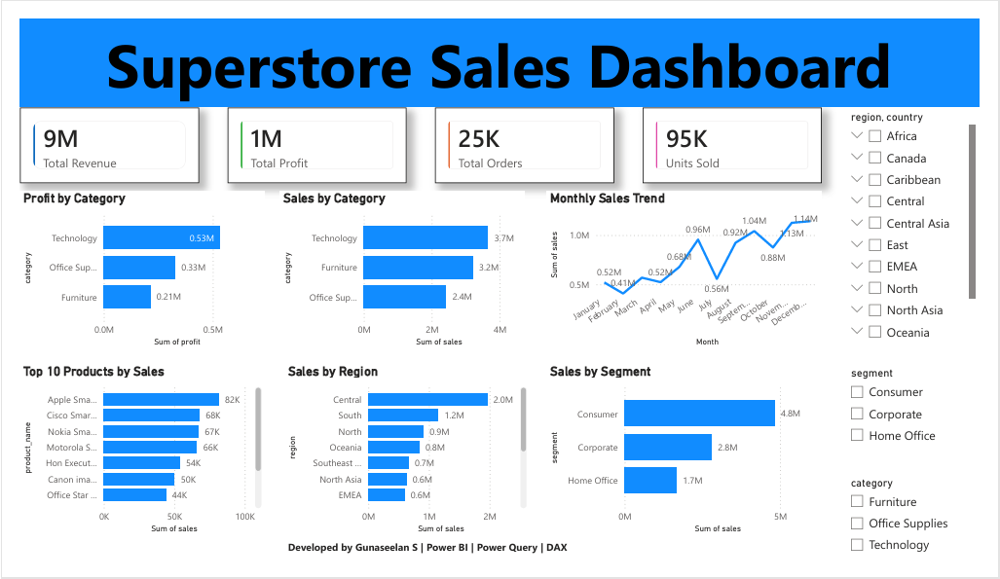

# SuperStore Sales Dashboard | Power BI

## Overview

This project presents an interactive Power BI dashboard developed using the SuperStore Sales dataset from Kaggle.

The objective was to transform raw sales data into meaningful business insights through data cleaning, modeling, DAX measures, and interactive visualizations.

---

## Tools & Technologies

- Power BI
- Power Query
- DAX
- CSV Dataset (Kaggle)

---

## Data Preparation

The raw dataset was cleaned and transformed using Power Query:

- Removed inconsistencies
- Corrected data types
- Handled missing values
- Optimized data structure
- Prepared data for analysis

---

## KPI Metrics

| KPI | Value |
|------|------|
| Total Revenue | 9M |
| Total Profit | 1M |
| Total Orders | 25K |
| Units Sold | 95K |

---

## Dashboard Features

### Sales Analysis
- Sales by Category
- Monthly Sales Trend
- Sales by Region
- Sales by Customer Segment

### Profit Analysis
- Profit by Category

### Product Analysis
- Top 10 Products by Sales

### Interactive Filters
- Region
- Segment
- Category

---

## Key Insights

- Technology category generated the highest sales and profit.
- Consumer segment contributed the largest share of revenue.
- Central region achieved the highest sales.
- Sales peaked during the final quarter of the year.
- Top-performing products contributed significantly to overall revenue.

---

## Skills Demonstrated

- Data Cleaning
- Data Transformation
- Power Query
- DAX Measures
- Dashboard Design
- Data Visualization
- Business Intelligence
- Analytical Thinking

---

## Dashboard Preview

---

## Files Included

- SuperStore_Sales.pbix
- SuperStore_Sales.pdf
- SuperStoreOrders.csv
- dashboard.png

---

## Author

Gunaseelan S

LinkedIn:
https://www.linkedin.com/in/gunaseelan-s-data-analyst/

GitHub:
https://github.com/gunaseelan190426
